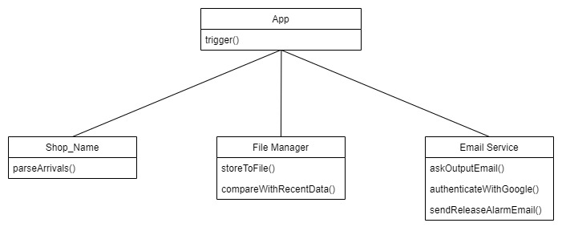

# **whiskey_release_radar**
## **A web scraping micro service to track new whiskey releases via email**

### **Prerequisites:**

> This app needs to be authorized with a google account to send e-mails through it. 
> The gmail api needs to be activated for this account in the [google api console](https://console.cloud.google.com/apis). 
> After creating credentials, the generated *credentials.json* file needs to be placed at the root of this project. 
> A more detailed guide on how to setup an account for usage with google apis can be found [here](https://developers.google.com/identity/protocols/oauth2). 

### **How to run:**

> * *npm install* 
> * *npm run start*

### **How it works:**

On start up you will be asked to provide the email adress that will receive emails, when new releases are available, on the command line. 
Afterwards the application will try to authenticate with google and therefore print a sign in link to the console.

> If you encounter the message: *"Error loading client secret file"* 
> Make sure you stored your google accounts *credentials.json* at the root of the project folder, as described above.

Follow the link, log into the google account and copy the generated token back into the console to complete the app authentication process. 
If a previously stored token is available and still valid, this step will be skipped. 
From this point on, the application will check the supported shops on a 5 minute interval and send emails once new products are available.

The different shop classes contain the [puppeteer](https://github.com/puppeteer/puppeteer) scaping logic for each indivial shop.
The shops parseArrivals function returns all the products available on the scraped page.

The file manager class compares the scraped data to the most recently saved data (if there is any) to determine which products are new arrivals, then saves the scraped data to a json file.

New arrivals will be passed to the email service and sent through the authenticated account to the provided email adress.

 

Currently supported shops:

https://www.weinquelle.com/ 
https://www.getraenkewelt-weiser.de/ 
https://www.deinwhisky.de 